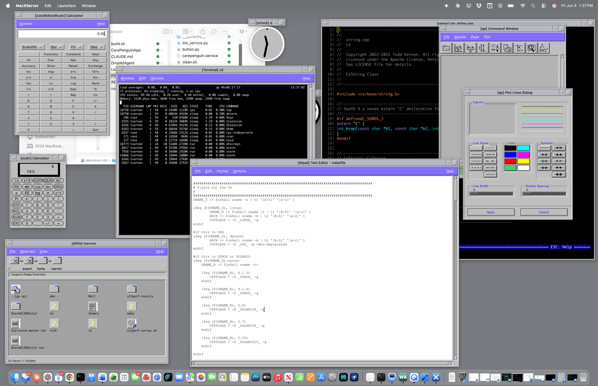

# MacXServer

[](https://macxserver.com)

A modern X11 server in Swift for macOS, plus a capture toolchain for
recording and inspecting X11 wire traffic. Built so I can display X
applications from real vintage Sun workstations on my Mac with proper
modern rendering. The Swift package is internally called `swift-x`.

The project has two pieces: a Swift X server that real X clients
connect to as their display, and a capture utility that records X11
sessions to disk and can replay them. They share a typed Swift wire
decoder (the framer) and a common `.xtap` file format.

To learn more, with screenshots and the build log, see
[macxserver.com](https://macxserver.com).

## What's here

- `Sources/Framer/` — typed Swift decoders for the X11 core protocol.
  Covers every opcode that any of the captured Sun apps emit, plus
  encoders for the replies the server has to produce.
- `Sources/SwiftXServer/` + `Sources/SwiftXServerCore/` — the X11
  server. Rootless mode: each top-level X window becomes a real
  `NSWindow` with native chrome. Core Text font rendering with
  scalable substitutes for the X11 bitmap fonts the Sun apps ask
  for. Runs xterm, xcalc, xclock, xeyes, twm/mwm, quickplot (a
  Motif graphing app), and CDE's dt-apps (dtcalc, dtterm,
  dthelpview, dtpad, dticon).
- `Sources/SwiftXCapture/` + `Sources/SwiftXCaptureCore/` +
  `Sources/SwiftXCaptureUI/` — the capture utility (a SwiftUI app, a
  core library, and a CLI). Single binary, two faces:
  - **SwiftUI app** (what most people will use): three modes. Record
    (proxy a session interactively with live byte counters and a
    decoded-opcode feed), Open (pick a `.xtap` and browse packet by
    packet), Replay (pipe a `.xtap` into a target server with progress
    bar, cancel button, and hold-open).
  - **CLI**: proxy capture, dump, summary, diff, replay
    subcommands. Backwards-compatible with the v1 tool.

  The server can also tee its own sessions to `.xtap` files via
  `--capture`, handy for attaching a capture to a bug report.
- `captures/` — `.xtap` files from real Sun workstations. xterm
  (multiple sessions), xeyes, xclock, xcalc, quickplot, and the
  full CDE dt-app suite.
- `Tests/` — over 1,200 tests across the framer, capture library,
  server core, file format, and end-to-end integration paths.

## Quick start

The server and the capture tool are two Mac apps. Build and run them from
Xcode (15+, macOS 14+) so you get the real `.app` bundles with their icons
and menu-bar presence. Open `MacXServer.xcodeproj`; there are two schemes:

- **MacXServer** is the X server. Run it (⌘R) and a status item appears in
  the menu bar with the listen address (port 6000 maps to display `:0`) and
  a Stop Server item. Preferences (⌘,) cover clipboard bridging, font
  mappings, and capture.
- **MacXCapture** is the capture app, covered below.

With the server running, point an X client at it from a real Sun (or
anywhere on the LAN):

```
xterm -display <mac-ip>:0
```

### The capture app

`MacXCapture` is how most people will use the capture tool. Run the
**MacXCapture** scheme in Xcode. Three modes:

- **Record**: proxy a live session with byte counters and a decoded-opcode
  feed.
- **Open**: pick a `.xtap` file and browse it packet by packet.
- **Replay**: pipe a `.xtap` into a target server, with a progress bar,
  cancel, and hold-open.

It opens files from `/tmp/macxcapture/` by default, so the server's
auto-captures are one click away.

### Server-side capture

Turn on capture in the server's Preferences, Capture tab (or launch the
binary with `--capture`). Every X client that connects gets its own `.xtap`
file in `/tmp/macxcapture/`, named after its `WM_CLASS`. `/tmp` wipes on
reboot, so captures don't pile up.

For bug reports: turn capture on, reproduce the issue, and attach the
freshest file from `/tmp/macxcapture/` to a GitHub issue (see
CONTRIBUTING.md).

### Command-line builds and the CLI

`swift build -c release` builds everything and is what `swift test` uses,
but it produces bare command-line binaries in `.build/release/` with no
`.app` bundle, so the server won't get its real menu-bar icon. Use Xcode
for the polished apps; reach for `swift build` when you want headless or
scripted runs.

The capture tool also keeps a full CLI (the v1 interface). Any subcommand
runs the CLI; no args launches the GUI; `--no-gui` forces headless mode for
scripts.

```
# proxy two real X endpoints
.build/release/macxcapture \
    --listen :6001 \
    --forward sun-b.lan:6000 \
    --output session.xtap

# decoded chronological dump
.build/release/macxcapture dump captures/xterm-running-on-ss2-display-on-ss2.xtap

# aggregate per-opcode summary
.build/release/macxcapture summary captures/xcalc-running-on-ss2-display-on-ss2.xtap

# byte-pump replay into a target server
.build/release/macxcapture replay captures/xclock-running-on-ss2-display-on-ss2.xtap \
    --target localhost:6000
```

`./run-capture.sh`, `./run-server.sh`, and `./run-all.sh` are build-and-run
wrappers around the command-line binaries. `run-capture.sh` reads
`connection.json` (`listen` / `forward` / `output`) for proxy mode; copy
`connection.example.json` to `connection.json` and edit it first, since the
real file is gitignored so your host stays local. `run-all.sh` starts
macxserver plus a proxy capture forwarding into it, for diffing what swiftx
produces against gold Sun captures.

## Tests

```
swift test
```

## Documentation

The full project context lives in markdown at the repo root:

- `PROJECT.md` — what we're building, the two-product plan,
  explicit non-goals
- `ARCHITECTURE.md` — how the components fit together
- `DECISIONS.md` — architectural choices with reasoning,
  append-only
- `PRODUCT_1_CAPTURE.md` — capture utility: v1 (CLI, done) and v2
  (library + GUI app + server-side capture, in flight)
- `PRODUCT_2_SERVER.md` — X server scope and milestones
- `OPCODE_STATUS.md` — per-opcode implementation status with
  honest confidence ratings
- `SHORTCUTS.md` — known stubs, fakes-on-the-wire, and other
  ledgered tech debt
- `CLAUDE.md` — instructions for collaborator agents

## Status

**Capture utility**: v1 (CLI proxy + framer + corpus) done. v2
(shared library + SwiftUI app + server-side `--capture`) landed.
Single binary hosts both faces.

**Swift X server**: M1–M3 green. xterm, xcalc, xeyes, xclock,
twm/mwm, quickplot (Motif), and the CDE dt-apps all run from a
real Ultra 5 against the Mac. Core Text font substitution with
cell-snapping is in. Server-side capture is wired so any client
session lands as a `.xtap` for inspection. See
`PRODUCT_2_SERVER.md` for milestone definitions and
`OPCODE_STATUS.md` / `SHORTCUTS.md` for what's shipped vs
stubbed.

## Requirements

macOS 14 or later and a recent Swift toolchain (Xcode 15+). No other
dependencies.

## Contributing

The most useful contributions are good bug reports with an `.xtap`
capture attached, and captures from X clients I don't have access to.
Code contributions are welcome too. See `CONTRIBUTING.md` for the build,
the capture-a-bug workflow, and the ledger conventions, and
`CODE_OF_CONDUCT.md` for the ground rules.

## License

Apache-2.0. See `LICENSE`. Portions are derived from the X11R6 reference
implementation; those files retain the original X Consortium / Digital
Equipment Corporation notices, summarized in `NOTICE`.
